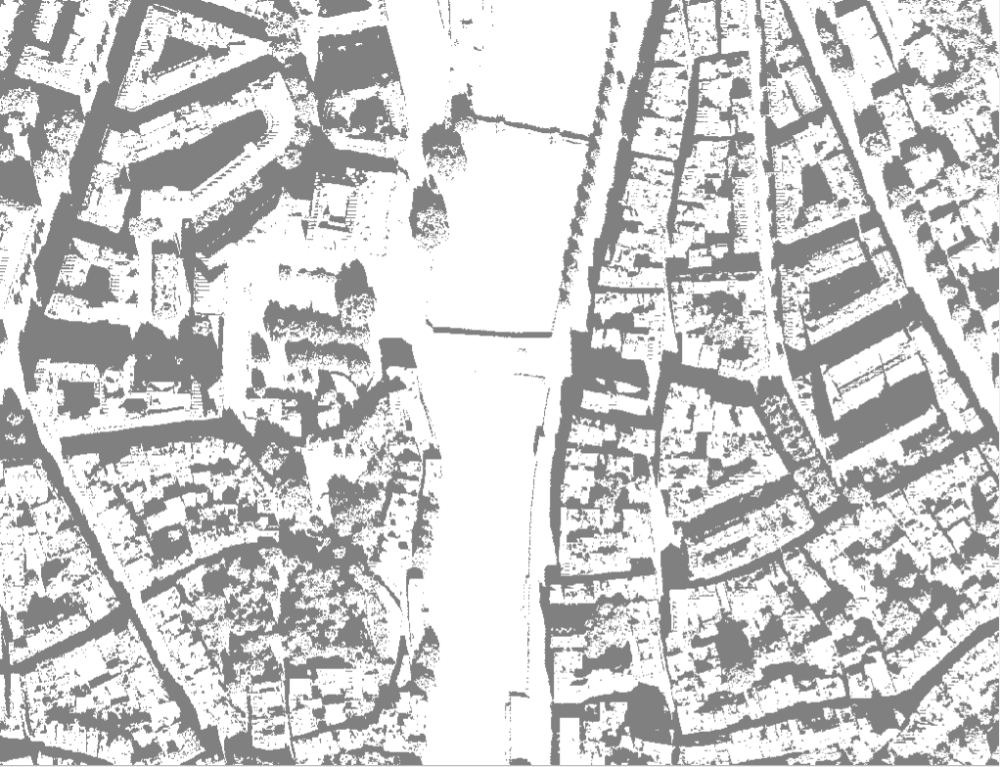
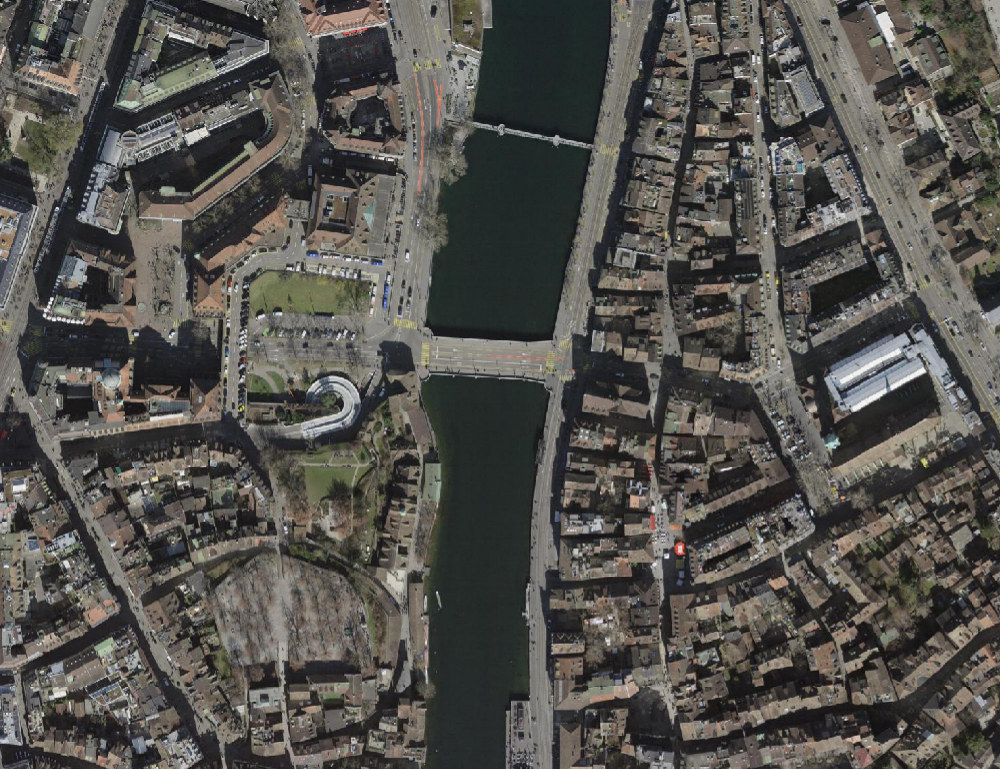
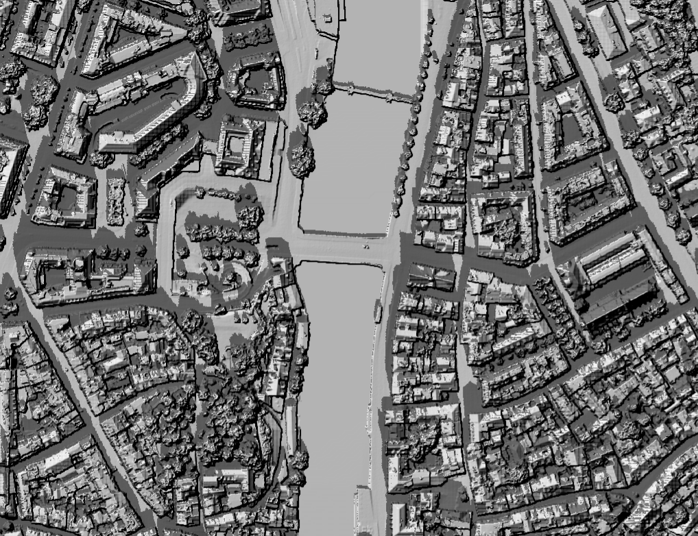
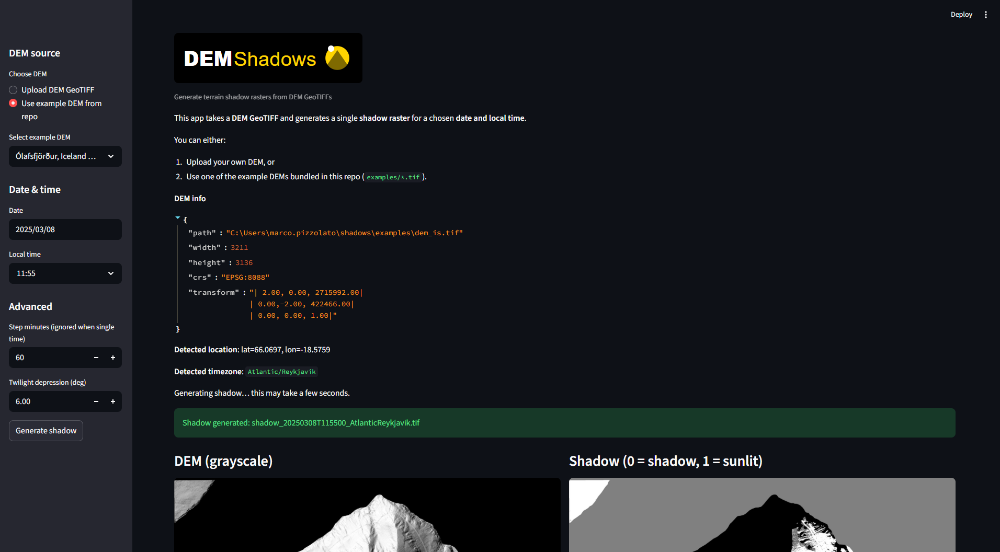

[](LICENSE)


# DEM-Shadows  
Generate high-resolution terrain shadow rasters and animations from DEM GeoTIFFs.




---

## Table of Contents
- [Overview](#overview)
- [Features](#features)
- [Installation](#installation)
- [Project Structure](#project-structure)
- [Quick Start](#quick-start)
  - [1. Generate Shadows](#1-generate-shadows)
  - [2. Animate Shadows](#2-animate-shadows)
  - [3. Cumulative Shadow Map](#3-cumulative-shadow-map)
- [CLI Reference](#cli-reference)
  - [`dem-shadows-generate`](#dem-shadows-generate)
  - [`dem-shadows-animate`](#dem-shadows-animate)
  - [`dem-shadows-cumulate`](#dem-shadows-cumulate)
- [Examples](#examples)
- [Testing](#testing)
- [Streamlit App](#streamlit-app)
- [License](#license)

---

## Overview
`dem-shadows` is a lightweight Python toolchain for:

- Merging DEM tiles  
- Converting DEMs to metric projected CRS  
- Computing *per-timestamp* shadow rasters using the `insolation` package  
- Auto-detecting latitude, longitude, and timezone from DEM extent  
- Rendering **animated GIFs** of shadow progression  
- Rendering cumulative “shadow exposure maps"  

The goal is to provide **easy**, **reproducible**, and **open-source** shadow modelling for any DEM.

---

## Features

✔ Merge DEM tiles automatically  
✔ Auto lat/lon from DEM center  
✔ Auto timezone inference via `tzfpy`  
✔ Robust shadow modeling (`insolation` `sunvector + doshade`)  
✔ Zero-dependency GIF animation (Pillow only)  
✔ Transparent or white-background output modes  
✔ Cumulative exposure computation  
✔ Optional Streamlit GUI  
✔ Fully cross-platform (Windows / Linux / macOS)

---

## Installation

### Clone & install locally
```bash
git clone https://github.com/marcop11/dem-shadows.git
cd dem-shadows
pip install -e .
```

### Requirements
Automatically installed:
- rasterio
- numpy
- pandas
- Pillow
- tqdm
- astral
- insolation>=0.1.9
- tzfpy

Optional:
```bash
pip install streamlit
```

---

## Project Structure

```
dem-shadows/
│
├── app/
│   └── streamlit_app.py
│
├── examples/
│   └── dem.tif              # Example DEM for README & demos
│
├── img/
│   ├── app.png
│   ├── icon.svg
│   ├── logo.svg
│   ├── zh_example_sh.png
│   ├── zh_example_dtm.png
│   ├── zh_example_ortho.png
│   ├── zh_example_sh_cum.png
│   └── zh_example_animate.gif
│
├── src/
│   └── dem_shadows/
│       ├── shadows.py       # DEM → shadows
│       ├── animate.py       # GIF generation
│       ├── analysis.py      # Cumulative shadows
│       ├── preprocess.py
│       ├── utils.py
│       ├── schedule.py
│       ├── config.py
│       └── __init__.py
│
├── tests/
│   └── test_basic.py
│
├── README.md
├── pyproject.toml
└── requirements.txt
```

---

## Quick Start

### 1. Generate Shadows

Generate a single shadow at 11:55 on March 8th 2025 — automatically detects lat/lon + timezone:

```bash
dem-shadows-generate ^
  --dem-dir "examples" ^
  --out-dir "out" ^
  --auto-latlon ^
  --auto-timezone ^
  --start 2025-03-08 ^
  --end 2025-03-08 ^
  --only-time 11:55
```

Minimal example for a whole day shadow generation hourly on March 8th 2025 — automatically detects lat/lon + timezone:

```bash
dem-shadows-generate ^
  --dem-dir "examples" ^
  --out-dir "shadows_day" ^
  --auto-latlon ^
  --auto-timezone ^
  --start 2025-03-08 ^
  --end 2025-03-08
```

Resulting output (example):

```
shadows_day/
│
├── shadow_20250308T070000_EuropeZurich.tif
├── shadow_20250308T080000_EuropeZurich.tif
├── shadow_20250308T090000_EuropeZurich.tif
├── ...
└── schedule.csv
```

Each GeoTIFF contains:
- `0 = shadow`  
- `1 = sunlit`  
- `255 = nodata`  



---

### 2. Animate Shadows

Create a GIF from the folder:

```bash
dem-shadows-animate ^
  --shadow-folder "shadows_day" ^
  --out-gif "shadows_day.gif"
```

Example GIF (included in repo):

Shadows of Zürich on 8th March 2025.


---

### 3. Cumulative Shadow Map

```bash
dem-shadows-cumulate ^
  --shadow-folder "shadows_day" ^
  --out "shadow_cumulative.tif"
```

This produces a raster where the value of each pixel equals:

```
Number of hours of sun for per pixel
```

Example Cumulative Shadows (included in repo):

Cumulative shadows of Zürich on 8th March 2025.


---

## CLI Reference

---

### `dem-shadows-generate`

```
usage: dem-shadows-generate [OPTIONS]
```

**Required**
```
--dem PATH                # or --dem-dir PATH (automerge)
--out-dir PATH
--start YYYY-MM-DD
--end   YYYY-MM-DD
```

**Optional**
```
--auto-latlon
--auto-timezone
--lat FLOAT
--lon FLOAT
--timezone "Europe/Zurich"
--step-minutes 60
--only-time HH:MM
--dem-pattern "*.tif"
```

---

### `dem-shadows-animate`

```
usage: dem-shadows-animate [OPTIONS]
```

**Required**
```
--shadow-folder PATH
--out-gif PATH
```

**Optional**
```
--start YYYY-MM-DD
--end YYYY-MM-DD
--hour INT
--minute INT
--duration-ms 250
--sample-stride 1
--target-width 900
--target-height 0
--scale-factor FLOAT
--no-timestamp
--font-path PATH
```

---

### `dem-shadows-cumulate`

```
usage: dem-shadows-cumulate [OPTIONS]
```

```
--shadow-folder PATH
--out PATH
```

---

## Examples

### Example DEM
Located at:

```
examples/dem.tif
```

### Example imagery and shadow screenshots
Located at:

```
img/
├── app.png
├── icon.svg
├── logo.svg
├── zh_example_sh.png
├── zh_example_dtm.png
├── zh_example_ortho.png
├── zh_example_sh_cum.png
└── zh_example_animate.gif
```

These are referenced inside this README.

---

## Testing

Run all tests:

```bash
pytest -q
```

The `tests/` folder contains:

```
tests/
└── test_basic.py
```

`test_basic.py` ensures basic imports and config structures work.

---

## Streamlit App


You can run the GUI with:

```bash
streamlit run app/streamlit_app.py
```

Features:
- Upload DEM
- Choose start/end time
- Generate shadows
- Preview results
- Download outputs and GIF


Find more digital elevation or terrain models to try:
- [Switzerland](https://www.swisstopo.admin.ch/en/height-model-swisssurface3d-raster)
- [Iceland](https://ftp.lmi.is/gisdata/raster/)

---

## License
This project is licensed under [**GPLv3**](LICENSE).

[](LICENSE)